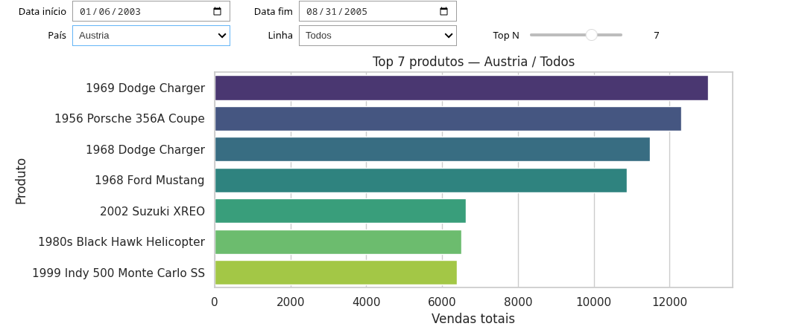

# Task 3 — Consultas Athena e dashboard

Implementação da [query.md](../../../query.md) §4: três consultas no Amazon Athena sobre o esquema estrela da Task 2 e dashboard interativo no Jupyter.

A lógica fica em `scripts/`; o notebook `classicmodels_dashboard.ipynb` apenas carrega os dados e exibe o painel.

## Pré-requisitos

1. **Task 1** concluída: RDS com `classicmodels`.
2. **Task 2 (ETL)** concluída: Glue Job `SUCCEEDED`, Parquet no S3 e tabelas no Glue Data Catalog — [`../task_2_redo`](../task_2_redo/).
3. Credenciais AWS válidas na sessão local (`aws sts get-caller-identity`).

## Configuração

```bash
cd aluno_kaiky/task_3
python -m venv .venv
source .venv/bin/activate   # Windows: .venv\Scripts\activate
pip install -r requirements.txt
```

Obtenha o nome do database Glue/Athena (após `terraform apply` e Glue Job na pasta `task_2_redo`):

```bash
cd ../task_2_redo/terraform
terraform output -raw glue_database_name
```

Atualize `GLUE_DATABASE` em `scripts/queries.py` com esse valor (padrão do Terraform: `classicmodels_star_g4`).

### Região AWS

O `awswrangler` exige região explícita. O padrão em `scripts/queries.py` é `us-east-1` (igual ao `aws_region` do Terraform). Se usar outra região, ajuste `AWS_REGION` ou exporte antes de rodar:

```bash
# Linux/macOS
export AWS_REGION=us-east-1

# Windows PowerShell
$env:AWS_REGION = "us-east-1"
```

Alternativa: configure no `~/.aws/config`:

```ini
[default]
region = us-east-1
```

## Estrutura

| Arquivo | Responsabilidade |
|---------|------------------|
| `scripts/queries.py` | `GLUE_DATABASE` e SQL das seções 4.2–4.4 |
| `scripts/athena_client.py` | Execução das consultas via `awswrangler` |
| `scripts/dashboard.py` | Widgets e gráfico da seção 4.5 |
| `classicmodels_dashboard.ipynb` | Visualização do dashboard |
| `results/` | Gráficos gerados via `python -m scripts.dashboard` |

## Execução

### Consultas (terminal)

Na raiz de `task_3` (para o pacote `scripts` resolver):

```bash
python -m scripts.athena_client
```

### Gráfico em `results/` (terminal)

Gera `results/top_products_default.png` com filtros padrão (intervalo completo, todos países/linhas, Top 5):

```bash
python -m scripts.dashboard
```

No notebook, `build_dashboard(df_detail, save_path="results/meu_grafico.png")` também salva ao atualizar os filtros.

## Resultado esperado

Após `python -m scripts.dashboard` (ou o dashboard no Jupyter com os mesmos filtros padrão), o arquivo `results/grafico.png` deve ser um gráfico de barras horizontais (seaborn) com:

- **Eixo Y:** nomes dos produtos (`product_name`), ranqueados por vendas.
- **Eixo X:** soma de `total_sales` (agregação de `sales_amount` da consulta 4.4).
- **Título:** `Top 5 produtos — Todos / Todos` (Top N, país e linha de produto selecionados).
- **Filtros padrão do `main`:** todo o intervalo de `full_date`, país **Todos**, linha **Todos**, **Top 5**.

Os valores exatos dependem do ETL da Task 2; o importante é o ranking refletir os filtros (por exemplo, restringir país ou `product_line` reduz o gráfico ao subconjunto filtrado).


*Exemplo gerado com filtros padrão. No seu ambiente, execute `python -m scripts.dashboard` com credenciais AWS e o Glue database configurado para substituir pela saída real do Athena.*

### Dashboard (Jupyter)

```bash
jupyter lab classicmodels_dashboard.ipynb
```

Execute a célula do notebook. Ela consulta o Athena (4.4) e monta o dashboard.

### Athena — bucket de resultados

Se as consultas falharem por falta de local de resultados, defina um bucket S3:

```bash
export ATHENA_S3_OUTPUT="s3://SEU-BUCKET-DE-RESULTADOS/athena/"
```

No ambiente de lab, o workgroup `primary` costuma já apontar para um bucket válido.

## Critérios de conclusão (enunciado)

1. Três consultas Athena bem-sucedidas: `dim_products` (4.2), vendas por país (4.3), detalhamento (4.4) — via `scripts/athena_client.py`.
2. Dashboard com intervalo de datas, país, linha de produto, Top N e gráfico de barras coerente com os filtros.
3. Apenas esquema estrela da Task 2 — sem SQL contra o RDS da Task 1.

## Exemplo de resultado após testar em `classicmodels_dashboard.ipynb`:

